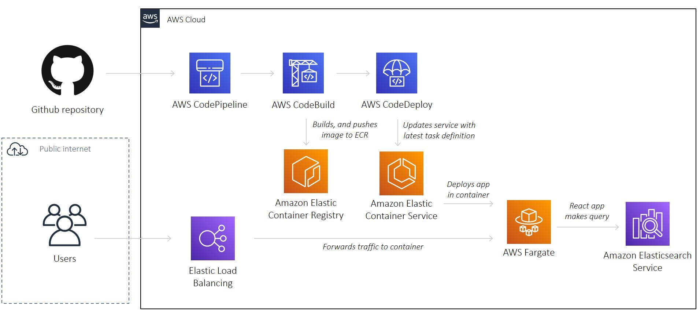

# AWS React App with Elasticsearch

A reference project to deploy a React app onto Amazon ECS on AWS Fargate, and Amazon Elasticsearch Service with Terraform

A todo app fetching data from Amazon Elasticsearch Service



## Pre-requisite

-   Make sure you have installed [Terraform](https://learn.hashicorp.com/tutorials/terraform/install-cli), [AWS CLI](https://docs.aws.amazon.com/cli/latest/userguide/install-cliv2-mac.html#cliv2-mac-prereq), and configured a `default` AWS CLI profile (see doc [here](https://docs.aws.amazon.com/cli/latest/userguide/cli-configure-quickstart.html#cli-configure-quickstart-profiles))

```bash
terraform -help # prints Terraform options
which aws # prints /usr/local/bin/aws
aws --version # prints aws-cli/2.0.36 Python/3.7.4 Darwin/18.7.0 botocore/2.0.0
aws configure # configure your AWS CLI profile
```

## Configuration

-   Create a Github project, and generate a personal access token (see doc [here](https://docs.github.com/en/github/authenticating-to-github/creating-a-personal-access-token))

-   Create an [S3 bucket](https://www.terraform.io/docs/language/settings/backends/s3.html) to store Terraform state. Populate bucket name in `01-main.tf`

*   Create a secret on [AWS Secrets Manager](https://aws.amazon.com/secrets-manager/) named `DockerHubAccessToken` with key `DOCKER_HUB_ACCESS_TOKEN`, and your [Docker access token](https://docs.docker.com/docker-hub/access-tokens/) as value

-   Populate `terraform.tfvars`:

```bash
default_region      = "us-east-1"
docker_username     = "matlau"
github_username     = "MatthewCYLau"
github_project_name = "aws-react-elasticsearch-terraform"
app_name            = "aws-elasticsearch-app"
environment         = "staging"
upload_bucket_name  = "matlau-s3-es-upload"
```

## Deploy Lambda packages

-   Create an S3 bucket to store your Lambda function packages
-   Navigate to `/deploy/lambdas/<FUNCTION_NAME>`
-   Update the `deploy/lambdas/<FUNCTION_NAME>/updateFunction.sh` shell script with correct values i.e. Amazon S3 bucket name, and key. See documentation on AWS CLI `update-function-code` [here](https://awscli.amazonaws.com/v2/documentation/api/latest/reference/lambda/update-function-code.html)

-   Run the script:

```bash
sh deploy/lambdas/<FUNCTION_NAME>/updateFunction.sh
```

Note, you may encounter `Function not found` error the first time running the script

## Deploy

```bash
cd deploy # change to deploy directory
terraform init # initialises Terraform
terraform apply # deploys AWS stack. See output for AWS loadbalancer DNS name
terraform destroy # destroys AWS stack
```

When prompted for `github_token`, provide the value and hit Return. Alternatively, create a [local environment variable](https://www.terraform.io/docs/language/values/variables.html#environment-variables) named `TF_VAR_github_token`

# Usage

-   Upload `deploy/lambdas/processS3Upload/data.csv` to the `upload_bucket_name` S3 bucket to trigger Lambda
-   Then, visit app at `aws_lb_dns_name` to view todos

# Local Development

-   Run `docker-compose up` to build, and run app in container

## Contributing

Pull requests are welcome. For major changes, please open an issue first to discuss what you would like to change.

Please make sure to update tests as appropriate.

If you find this project helpful, please give a :star: or even better buy me a coffee :coffee: :point_down: because I'm a caffeine addict :sweat_smile:

<a href="https://www.buymeacoffee.com/matlau" target="_blank"></a>

## License

[MIT](https://choosealicense.com/licenses/mit/)
